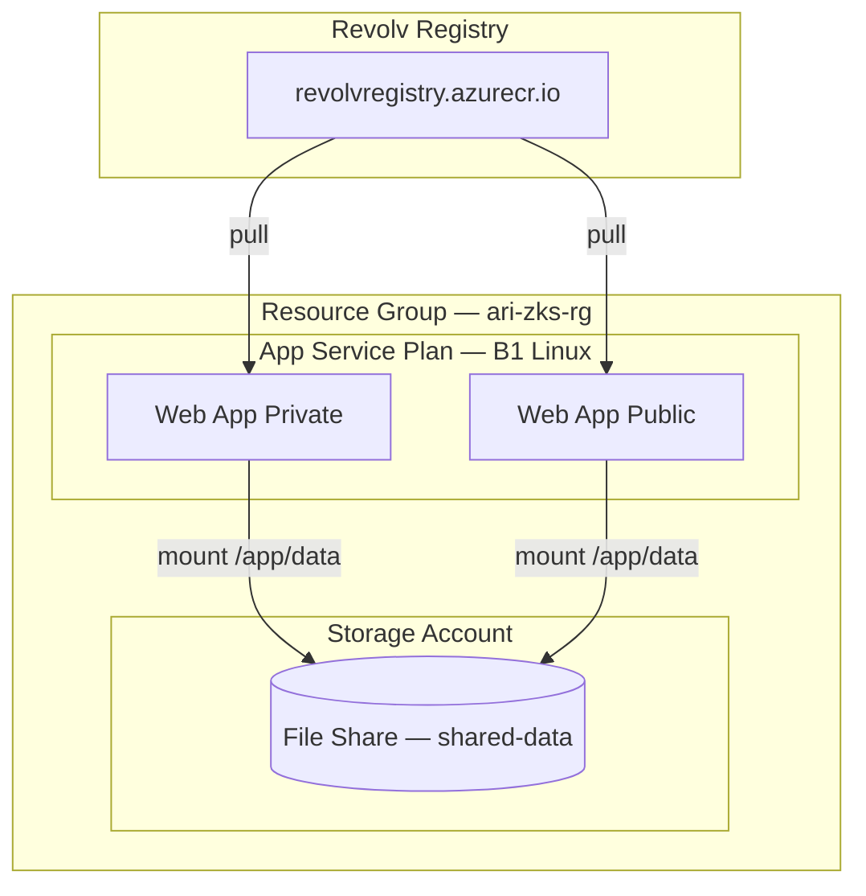
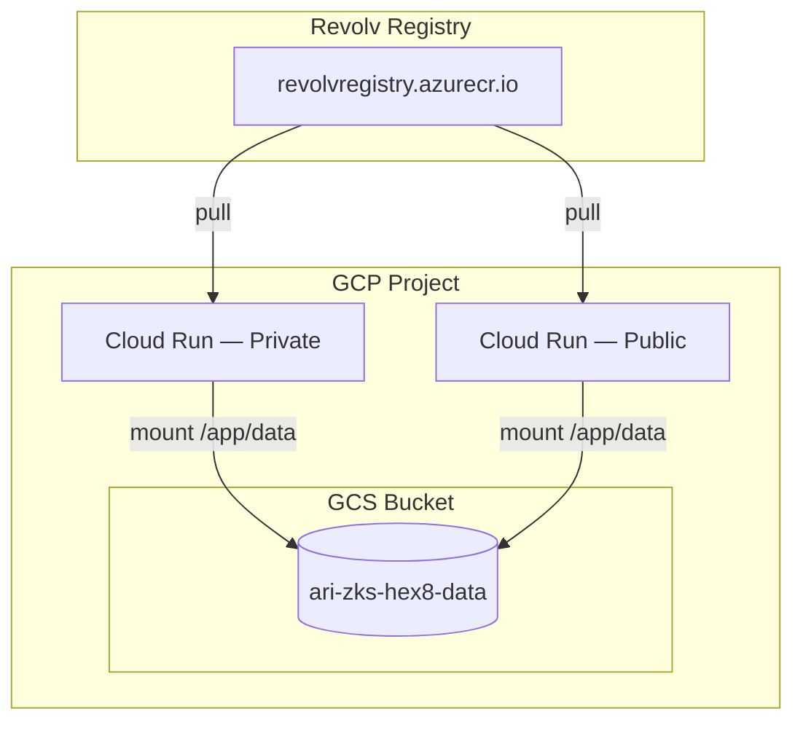
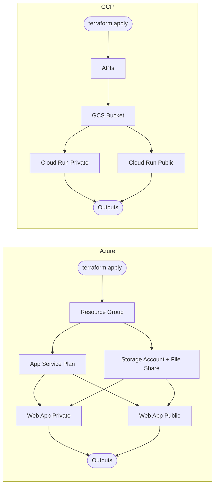

# ARI-ZKS — Déploiement Dual Web Apps

Déploie deux instances de l'application (instance `private` et instance `public`) depuis un container registry, avec un volume de stockage partagé entre les deux. Supporte Azure et GCP.

## Structure

```
terraform/
  azure/    — Azure App Service + Azure Files
  gcp/      — GCP Cloud Run + GCS Bucket
scripts/
  deploy-dual-instances.sh   — déploiement Azure via Azure CLI
```

---

## Architecture

### Azure



### GCP



### Flux de déploiement Terraform



---

## Estimation des coûts

> Tarifs indicatifs région **West Europe / europe-west1**, mars 2026. Hors trafic réseau sortant.

### Résumé

| | Azure | GCP |
|---|---|---|
| **Mois** | ~$14 | ~$0.10 |
| **An** | ~$163 | ~$1.20 |

> GCP est quasi-gratuit grâce au scale-to-zero de Cloud Run et au bucket GCS facturé à la consommation réelle.

### Détail Azure

| Ressource | SKU | Coût/mois |
|---|---|---|
| App Service Plan (2 apps) | B1 Linux | $13.14 |
| Azure Files | Standard LRS, 5 Go | $0.30 |
| Storage Account (opérations) | — | ~$0.01 |
| **Total** | | **~$13.45 / mois — ~$161 / an** |

> L'App Service Plan B1 tourne en continu même sans trafic — c'est le coût fixe incompressible d'Azure App Service.

### Détail GCP

| Ressource | SKU | Coût/mois |
|---|---|---|
| Cloud Run (2 services) | Scale-to-zero, free tier 2M req/mois | ~$0 |
| GCS Bucket | Standard, 5 Go | ~$0.10 |
| **Total** | | **~$0.10 / mois — ~$1.20 / an** |

> Cloud Run scale à 0 quand il n'y a pas de trafic — aucun compute facturé au repos. Le free tier couvre 2 millions de requêtes/mois, 360 000 vCPU-secondes et 180 000 Go-secondes, suffisant pour un usage modéré.

---

## Ressources créées

### Azure

| Ressource | Nom | Description |
|---|---|---|
| Resource Group | `ari-zks-rg` | Conteneur logique Azure |
| Storage Account | `arizks{hex8}storage` | Stockage Azure Files |
| File Share | `shared-data` | Volume partagé (5 Go) monté sur `/app/data` |
| App Service Plan | `ari-zks-{hex8}-plan` | Plan Linux B1 hébergeant les deux apps |
| Web App Private | `private-ari-zks-{hex8}` | Instance avec `ALLOW_PRIVATE_ACCESS=true` |
| Web App Public | `public-ari-zks-{hex8}` | Instance avec `ALLOW_PRIVATE_ACCESS=false` |

### GCP

| Ressource | Nom | Description |
|---|---|---|
| GCS Bucket | `ari-zks-{hex8}-data` | Volume partagé, monté sur `/app/data` |
| Cloud Run Private | `private-ari-zks-{hex8}` | Instance avec `ALLOW_PRIVATE_ACCESS=true`, scale-to-zero |
| Cloud Run Public | `public-ari-zks-{hex8}` | Instance avec `ALLOW_PRIVATE_ACCESS=false`, accès `allUsers`, scale-to-zero |

### Variables d'environnement injectées (communs)

| Variable | Valeur | Description |
|---|---|---|
| `ENV` | `azure` / `gcp` | Environnement d'exécution |
| `INSTANCE_ID` | `private` / `public` | Identifiant de l'instance |
| `ALLOW_PRIVATE_ACCESS` | `true` / `false` | Contrôle d'accès privé |
| `ENCRYPTION_KEY` | secret | Clé de chiffrement (auto-générée) |
| `REVOLV_SHARED_SECRET` | secret | Secret partagé Revolv (auto-généré) |
| `DATABASE_URL` | `sqlite:////app/data/data.db` | Base de données SQLite sur le volume partagé |

---

## Déploiement

### Azure — Terraform

#### Prérequis
- [Terraform](https://developer.hashicorp.com/terraform/install) >= 1.0
- [Azure CLI](https://learn.microsoft.com/fr-fr/cli/azure/install-azure-cli) connecté (`az login`)

```bash
cd terraform/azure/

cp terraform.tfvars.example terraform.tfvars
# Éditer terraform.tfvars

terraform init
terraform plan
terraform apply
```

#### Variables

| Variable | Requis | Défaut | Description |
|---|---|---|---|
| `container_image` | Oui | — | Image complète (ex: `registry.io/ari-zks:latest`) |
| `registry_username` | Oui | — | Utilisateur du registry |
| `registry_password` | Oui | — | Mot de passe du registry |
| `resource_group_name` | Non | `ari-zks-rg` | Nom du Resource Group |
| `location` | Non | `westeurope` | Région Azure |
| `encryption_key` | Non | auto-généré | Clé de chiffrement |
| `revolv_shared_secret` | Non | auto-généré | Secret partagé Revolv |

---

### GCP — Terraform

#### Prérequis
- [Terraform](https://developer.hashicorp.com/terraform/install) >= 1.0
- [gcloud CLI](https://cloud.google.com/sdk/docs/install) connecté (`gcloud auth application-default login`)
- Un projet GCP existant avec la facturation activée


```bash
cd terraform/gcp/

cp terraform.tfvars.example terraform.tfvars
# Éditer terraform.tfvars

terraform init
terraform plan
terraform apply
```

#### Variables

| Variable | Requis | Défaut | Description |
|---|---|---|---|
| `project_id` | Oui | — | ID du projet GCP |
| `container_image` | Oui | — | Image complète (ex: `registry.io/ari-zks:latest`) |
| `registry_username` | Oui | — | Utilisateur du registry |
| `registry_password` | Oui | — | Mot de passe du registry |
| `region` | Non | `europe-west1` | Région GCP |
| `encryption_key` | Non | auto-généré | Clé de chiffrement |
| `revolv_shared_secret` | Non | auto-généré | Secret partagé Revolv |

---

### Azure — Script shell

```bash
# Avec credentials en paramètres
./scripts/deploy-dual-instances.sh revolvregistry.azurecr.io/ari-zks:latest myuser mypassword

# Sans credentials (demandés interactivement)
./scripts/deploy-dual-instances.sh revolvregistry.azurecr.io/ari-zks:latest
```

Variables d'environnement optionnelles : `APP_NAME`, `RESOURCE_GROUP`, `LOCATION`, `ENCRYPTION_KEY`, `REVOLV_SHARED_SECRET`.

---

## Récupérer les secrets et outputs

```bash
# Nom auto-généré
terraform output app_name

# Secrets
terraform output -raw encryption_key
terraform output -raw revolv_shared_secret
```

---

## Commandes utiles post-déploiement

### Azure
```bash
az webapp log tail --name private-ari-zks-{hex8} --resource-group ari-zks-rg
az webapp restart  --name public-ari-zks-{hex8}  --resource-group ari-zks-rg
```

### GCP
```bash
gcloud run services logs read private-ari-zks-{hex8} --region europe-west1
gcloud run services update  public-ari-zks-{hex8}  --region europe-west1
```

---

## Notes

- L'image container doit être disponible dans le registry Revolv avant le déploiement.
- Le nom de l'application (`ari-zks-{hex8}`) est **toujours auto-généré** pour garantir l'unicité des ressources.
- Les deux instances partagent la même base de données SQLite via le volume partagé (`/app/data/data.db`).
- Le fichier `terraform.tfvars` est ignoré par git. Ne jamais le committer.
